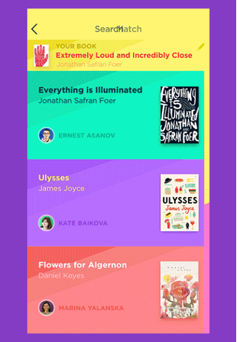

# BookSwap - My fork of "A Xamarin.Forms UI Challenge" by Kim Phillpotts
My main goal is to research "veeery rich" BookSwap app architecture via adding UWP target. 

## Screenshots

## About the original app
This UI Challenge is based on the fantastic dribble designs by [Tubik](https://dribbble.com/Tubik).  

## Code sessions (BookSwap dev)

### Youtube Session 1

### Youtube Session 2

### Youtube Session 3

## RnD status / My 2 cents
- Shared project switched from .NETStandard 2.0 to 1.4.
- iOS target disabled/deleted; UWP target added (19041/15063).
- UWP App compiled normally.
- UWP App started. Splashscreen ok.
- UWP App crashed. I have no idea what's happen... so strange. Can't debug... the app decomposition needed.

## Contributions
- All the designs I implement are intended to be for learning more about techniques to create beautiful Xamarin.Forms interfaces. 
- I welcome pull requests and suggestions to improve the solution. Please just raise an issue or submit a pull request.
- Feel free to take this code and do what you will, but please make sure you acknowledge myself and also the original designer.

## References
- https://twitch.tv/kymphillpotts    Kym's Twitch Channel
- https://dribbble.com/shots/3563019-Book-Swap-App-Interactions BookSwap App Dribble shots

## ..
AS IS. No support. RnD only / DIY.

## .
[m][e] 2022